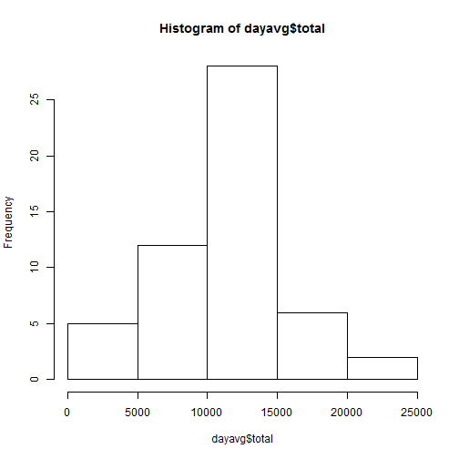
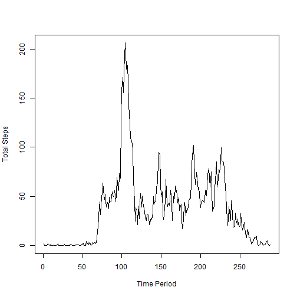
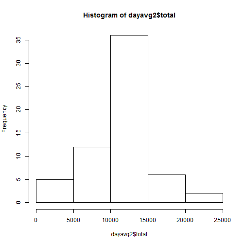
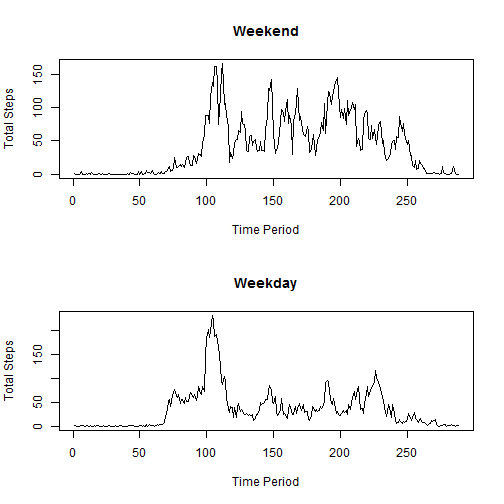

First we need to read the file from the active working directory and open the libraries we will use:


```r
activity<-read.csv("activity.csv")

library(knitr)
library(plyr)
```

Next we will convert the data columns to the classes we need for our analysis.


```r
activity$date<-as.Date(activity$date, "%Y-%m-%d")
activity$interval<-as.factor(activity$interval)
```

Now we will compute total steps per day and create the histogram:


```r
dayavg<-ddply(activity,"date", summarise, total=sum(steps))

hist(dayavg$total)
```

 

Next we compute the mean and median:


```r
mean(dayavg$total, na.rm=TRUE); median(dayavg$total, na.rm=TRUE)
```

```
## [1] 10766.19
```

```
## [1] 10765
```

Next we group by time intervals and plot and then compute where the maximum average occurs which is at 8:35 AM.


```r
interval<-as.data.frame(tapply(activity$steps, activity$interval, mean, na.rm=TRUE))

interval<-cbind(levels(activity$interval),interval)

names(interval)<-c("interval","avg_steps")

 plot(interval$avg_steps, type="l", xlab="Time Period", ylab="Total Steps")
```

 

```r
interval[which.max(interval$avg_steps),1]
```

```
## [1] 835
## 288 Levels: 0 10 100 1000 1005 1010 1015 1020 1025 1030 1035 1040 ... 955
```

Now we will replace missing values by the average value for that time period and redraw the histogram and compute the average and median:


```r
convertint<-rep(interval$avg_steps,61)

replace<-convertint*(is.na(activity$steps))

activity$steps[is.na(activity$steps)]<-0

activity$steps2<-activity$steps+replace

dayavg2<-ddply(activity,"date", summarise, total=sum(steps2))

hist(dayavg2$total)
```

 

```r
mean(dayavg2$total, na.rm=TRUE); median(dayavg2$total, na.rm=TRUE)
```

```
## [1] 10766.19
```

```
## [1] 10766.19
```
li
Now we create the weekday and weekend factor variable:


```r
activity$day<-weekdays(activity$date)

activity$weekend<-(activity$day=="Saturday" | activity$day=="Sunday")

activity$weekend[activity$weekend==TRUE]<-"Weekend"

activity$weekend[activity$weekend==FALSE]<-"Weekday"

activity$weekend<-as.factor(activity$weekend)
```

Next we subset the data and draw the plots:


```r
activityweekend<-activity[activity$weekend=="Weekend",]

activityweekday<-activity[activity$weekend=="Weekday",]

intervalwe<-as.data.frame(tapply(activityweekend$steps2, activityweekend$interval, mean, na.rm=TRUE))

intervalwe<-cbind(levels(activity$interval),intervalwe)

names(intervalwe)<-c("interval","avg_steps")

intervalwd<-as.data.frame(tapply(activityweekday$steps2, activityweekday$interval, mean, na.rm=TRUE))

intervalwd<-cbind(levels(activity$interval),intervalwd)

names(intervalwd)<-c("interval","avg_steps")

par(mfrow=c(2,1))

 plot(intervalwe$avg_steps, type="l", xlab="Time Period", ylab="Total Steps", main="Weekend")

 plot(intervalwd$avg_steps, type="l", xlab="Time Period", ylab="Total Steps", main="Weekday")
```

 
